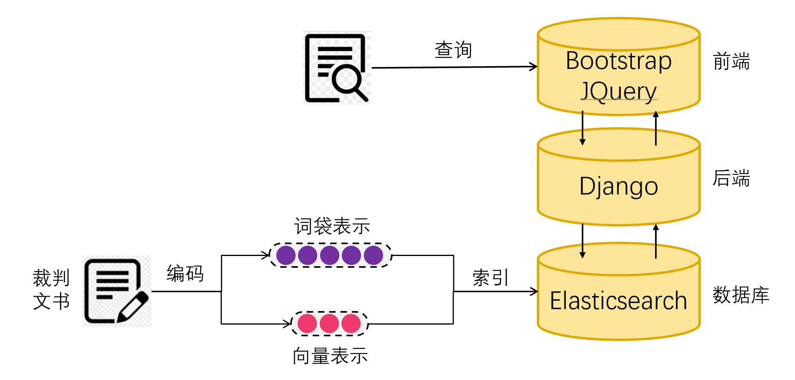

## Environments
- `elasticsearch==8.4.1`
- `django==4.0.3`
- `bootstrap==5.1.3`

## Instruction
```bash
bin/elasticsearch-plugin install analysis-smartcn
bin/elasticsearch

cd app
python manager.py runserver

# open localhost/search
```

## Framework

